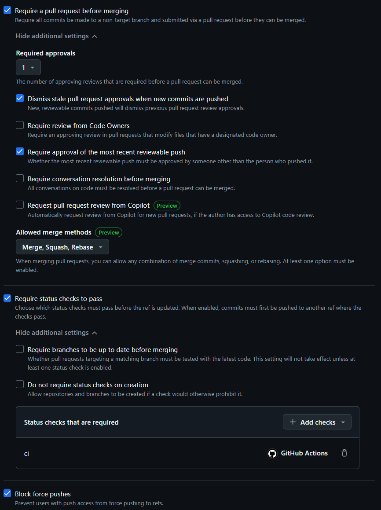
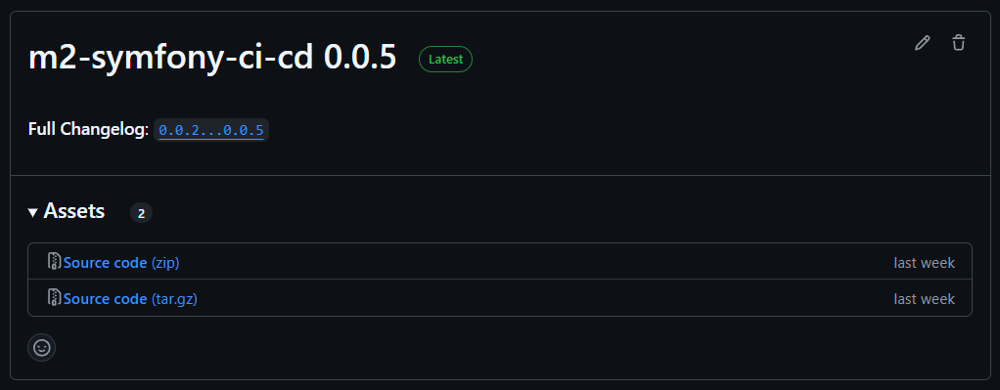

# m2-symfony-ci-cd

 \


## Team

- Somveille Quentin (skunka)
- Mathis ROME (muchu)

## Project

Vous trouverez dans ce repositiory, une application `Symfony` dans le dossier `app`.

Cette application contient une route ["/hello"](http://localhost/hello), qui exprime
tout l'amour que nous portons à Marion Playout et Damien Duportal.

Elle contient aussi un test applicatif qui vérifie que l'amour que nous portons
est toujours correctement exprimé.

Vous trouverez aussi, une tentative d'un `devcontainer`, même si celui-ci
manque encore d'un peu de maturité.

À la racine du projet vous trouverez nos images docker ainsi que le 
docker-compose de développement qui permet de lancer notre application en local.

Nous y retrouvons aussi, les images `docker` de production que nous publions dans le 
Docker Hub de `skunka` (Quentin). Vous trouverez ci-dessous les liens de repository Docker Hub :

- [Image NGINX](https://hub.docker.com/r/skunka/m2-ci-cd-nginx/tags)
- [Image Symfony](https://hub.docker.com/r/skunka/m2-ci-cd-symfony/tags)

De plus nous avons mis en place notre `workflow` Github Actions, nous avons donc 
2 fichiers `ci.yml` et `cd.yml`. Nous expliquerons ci-dessous leur contenu et leur utilité

Pour finir il y'a aussi notre `makefile` qui nous permet de lancer nos commandes dans la `ci`.

## Repository Rulesets

Nous avons mis en place une règle sur le repository GitHub: \
 \
Règle active sur les branches `main` et `develop`, elle applique les principes suivants :
- Un merge sur ces branches doit obligatoirement passer par des Pull Requests.
- Les Pull Requests nécessitent l'approbation d'un utilisateur qui ne soit pas le dernier utilisateur à avoir push un commit sur cette branche.
- Les Pull Requests nécessitent que l'action GitHub 'ci' soit valide avant de pouvoir merge même si approbation
- Il est impossible de `push --force` sur ces branches

## CI

Pour la CI, nous faisons les étapes dans l'ordre suivant :
1. Récupération des sources du projet
2. Mise en place d'une variable permettant le bon fonctionnement de notre makefile (pas besoin en local)
3. Utilisation du `makefile` pour installer les dépendances de notre projet via composer
    ```bash
    make install-dependencies 
    ```
4. Utilisation du `makefile` pour le linter `php` grâce à l'outil `phpstan`
    ```bash
   make lint
    ```
5. Utilisation du `makefile` pour le lancement des tests avec `phpunit`
    ```bash
   make tests
   ```
6. Vérification via `hadolint/hadolint-action@v3.1.0` du `Dockerfile` utilisé pour la construction de notre image `php`. 

    En local nous pouvons, reproduire le comportement de cette `Github Action` en lançant la commande suivante :
    ```bash
   docker run --rm -i  ghcr.io/hadolint/hadolint < php-fpm.prod.dockerfile
    ```
7. Utilisation du `makefile` pour le build de notre image `php`
    ```bash
   make build-symfony
   ```
8. Vérification via `hadolint/hadolint-action@v3.1.0` du `Dockerfile` utilisé pour la construction de notre image `nginx`
   
    En local nous pouvons, reproduire le comportement de cette `Github Action` en lançant la commande suivante :
    ```bash
   docker run --rm -i  ghcr.io/hadolint/hadolint < nginx.prod.dockerfile
    ```
9. Utilisation du `makefile` pour le build de notre image `nginx`
    ```bash
   make build-nginx
   ```
   
## CD

Notre plateforme de production est [Docker Hub Nginx](https://hub.docker.com/repository/docker/skunka/m2-ci-cd-nginx/general) pour l'image Nginx et [Docker Hub Symfony](https://hub.docker.com/repository/docker/skunka/m2-ci-cd-symfony/general)
pour l'image Symfony.

### Push on `main`

Avec la mise en place de notre ruleset, un push sur `main` passe obligatoirement par une pull request lors de laquelle
le job de CI doit être valide. \
Une fois la pull request approuvé par un utilisateur et qu'elle est merge, un commit de merge est push sur la branche `main`
ce qui déclenche le job de CD dont voici les étapes effectuées, si réalisé manuellement :
1. Récupération des sources du projet et se mettre à jour sur la branche `main`
2. Connexion au Docker Hub
```bash
   docker login --username=skunka
```
3. Build de l'image Symfony
```bash
  make build-symfony
```
4. Build de l'image Nginx
```bash
  make build-nginx
```
5. Push de l'image Symfony
```bash
  docker push skunka\m2-ci-cd-symfony:latest 
```
6. Push de l'image Nginx
```bash
  docker push skunka\m2-ci-cd-nginx:latest 
```

Se rendre ensuite sur la plateforme de production pour vérifier la présence des images avec le tag `latest`.

### Push d'un nouveau `tag`

Lors du push d'un nouveau tag sur le dépôt GitHub, voici les étapes: 
1. Récupération des sources du projet et se mettre à jour sur la branche `main`
2. Création d'un nouveau tag
```bash
  git tag 2.4.3
```
3. Push du tag sur le dépôt
```bash
  git push origin tag 2.4.3
```
3. Connexion au Docker Hub
```bash
  docker login --username=skunka
```
4. Build de l'image Symfony
```bash
  make build-symfony
```
5. Build de l'image Nginx
```bash
  make build-nginx
```
6. Push de l'image Symfony
```bash
  docker push skunka\m2-ci-cd-symfony:2.4.3 
```
7. Push de l'image Nginx
```bash
  docker push skunka\m2-ci-cd-nginx:2.4.3
```

Se rendre ensuite sur la plateforme de production pour vérifier la présence des images avec le tag `latest`.

### Définition du tag pour DockerHub
Le job étant le même pour les deux déclencheurs, une condition permet de définir quel tag sera utilisé dans le job:
- Si c'est un push sur `main` : latest
- Si c'est un nouveau tag : le nom du tag (ex: v2.4.3)

### Création d'une version

Dans le cas où le job cd est déclenché par un nouveau tag, une étape supplémentaire a lieu pour permettre la création d'une nouvelle version
sur le dépôt GitHub avec des notes de versions générées automatiquement.

Voici comment le faire manuellement (le tag doit déjà être existant sur le dépôt) : 
```bash
  gh release create "[2.4.3]" \
              --repo="https://github.com/BlueSkunka/m2-symfony-ci-cd" \
              --title="https://github.com/BlueSkunka/m2-symfony-ci-cd v2.4.3" \
              --generate-notes
```

L'option `--generate-notes` permet de créer des notes de version à partir des différences entre cette version et la précédente. 

Se rendre ensuite sur la page des versions pour constater la présences d'une nouvelle version :  
